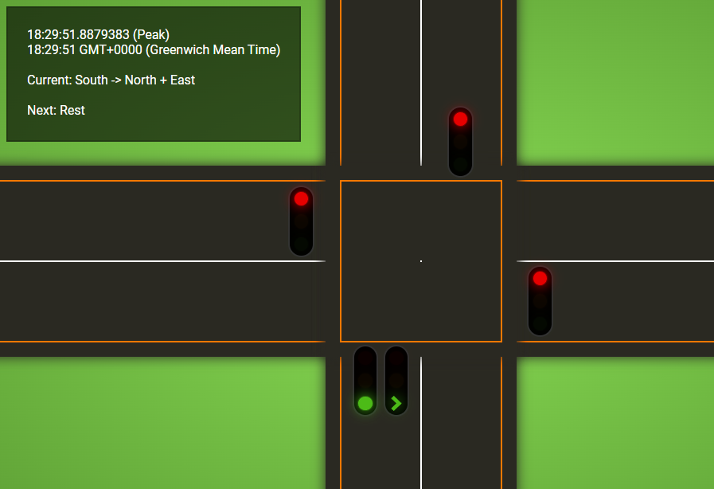

## How to run (TL;DR)

1. Clone the repository
2. Change to the `src/TrafficLight` folder
3. Run the following commands:
   ```
   npm i
   npm run release
   dotnet run
   ```
4. Open your browser to https://localhost:7127 or http://localhost:5022 and watch a boring traffic light simulator

Note: Depending on what time of day you run this app, you'll either get the Normal/Default sequence, or the Peak one. See [requirements](#requirements) for details

## Introduction

This repo is my coding exercise submission for a new position. It demonstrates a working knowledge of a number of different technologies and patterns, namely:

1. .NET 6
2. SignalR
3. TypeScript
4. CSS/HTML



There are a number of self-imposed challenges I decided to set myself. I did this because either it was an area of weakness in my knowledge, I hadn't done it in a while, or simply because I like pain 😜. These challenges included:
1. Don't use any images. All styling to be done using HTML/CSS
2. SignalR will be the back-bone of the application. I could have opted for simply calling an API to get the current state, but SignalR is awesome.
3. Multiple browsers can connect to the same back-end, and get exactly the same result in realtime.
4. A configurable tick-delay, in order to manage responsive vs performance
5. ALWAYS complete the bonus challenge! 😎

## Developer Notes

Given more time, I would have liked to implement the following:

1. A method for setting the current time. This would make live testing a lot easier, but from minor investigations, it seems you can't stop/start a BackgroundService once the application is running. Perhaps I could have make the worker respond to a change in time.
2. Configuration documentation. I might create a short wiki.
3. In the UK, when lights are about to turn from red to green, the amber light is shown as well as the red. It wasn't clear in the requirements whether I should do this, so I decided to leave it out. It should be fairly simple to implement by adding a new `RedAmber` state, and making changes to `TrafficLightStatusProvider.GetState`. There would also need to be some minor front-end changes, as it only can only keep one light on at any given time.
4. I considered using `Three.js` for the front-end, as this is something I'm keen to learn - but time and relevance didn't allow.
5. Due to the nature of combining a web app with SignalR, I'm not overly keen on the file/folder structure. I'd like to refactor and split it out.

## Requirements
In this test we would like you to implement a traffic light system. We are required to have 4 sets of lights, as follows. 

- Lights 1: Traffic is travelling south 
- Lights 2: Traffic is travelling west 
- Lights 3: Traffic is travelling north
- Lights 4: Traffic is travelling east

- The lights in which traffic is travelling on the same axis can be green at the same time. 
- During normal hours all lights stay green for 20 seconds.
- During peak times north and south lights are green for 40 seconds while west and east are green for 10 seconds. 
- Peak hours are 0800 to 1000 and 1700 to 1900. 
- Yellow lights are shown for 5 seconds before red lights are shown. 
- Red lights stay on until the cross-traffic is red for at least 4 seconds, once a red light goes off then the green is shown for the required time(eg the sequence is reset). 

**Bonus**: At this intersection north bound traffic has a green right-turn signal, which stops the south bound traffic and allows north bound traffic to turn right. This is green at the end of north/south green light and stays green for 10 seconds. During this time north bound is green, north right-turn is green and all other lights are red. 

## Implementation/Outcomes
1. Implement a front-end and backend (you can use ‘dotnet new’ templates of your choice)
2. The backend will contain the logic and state of the running traffic lights. The front-end will be a visual representation of the traffic lights, with the data served from the backend. 
3. There’s no need to have a perfect design on the front end, something simple and functional is fine (unless this is an area of strength you would like to show off). Noting* we will review the client side code.
4. There’s no need to implement entity framework (or similar) to store the data in a database, a in-memory store is fine
5. Code needs to follow architecture & best practices for enterprise grade systems

**Note**: Code will be evaluated not just for function, but on the quality of the code.
